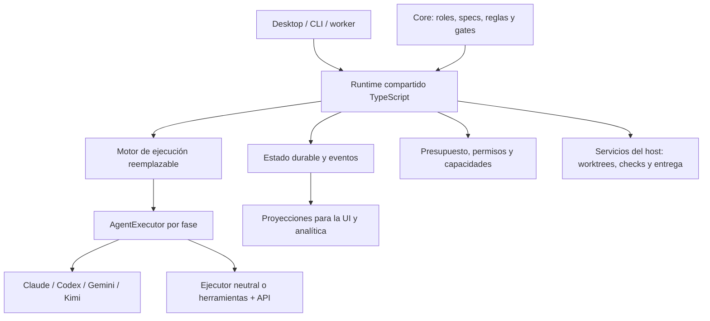

# Evolución de Specrails hacia un runtime de agentes

Análisis del 11 de septiembre de 2026. Recomendación arquitectónica basada en el código local y documentación oficial de los proyectos comparados.

**Recomendación**

Sí merece la pena pasar a una ejecución programática: Specrails debe decidir qué agente se ejecuta, con qué contexto, proveedor, herramientas, límites y evidencia de finalización. Recomiendo un runtime TypeScript compartido entre Core, Desktop y futuros workers. Conservaría el conocimiento y los controles de Specrails, y utilizaría componentes existentes para la infraestructura genérica.

LangGraph.js es mi candidato preferido para el motor de workflows. Lo validaría con un piloto frente a un dispatcher TypeScript mínimo que reutilice el journal actual de Core. La adopción se justifica si simplifica de forma demostrable reanudación, interrupciones y coordinación de ramas; añadir otra máquina de estados para ejecutar las mismas seis fases no sería suficiente.

Usaría `ai-agent-dev` como referencia de patrones y de un ejecutor Claude. No lo convertiría directamente en el motor general. Tampoco introduciría simultáneamente LangGraph, Mastra y otro supervisor de agentes. El objetivo es tener una autoridad clara para ejecutar el workflow.

**Alcance y confianza del análisis**

Se revisaron código, contratos, manifiestos, lockfiles, tests existentes y documentación de tres repositorios. `specrails-web` no se auditó funcionalmente: la decisión afecta principalmente a los tres componentes siguientes.

| Repositorio | Versión local | Commit de referencia | Situación |
| --- | --- | --- | --- |
| ai-agent-dev | 0.40.4 | `2949748` | Sin cambios locales detectados al iniciar |
| specrails-core | 5.1.0 | `2a8265e9` | Con cambios locales previos, incluidos runtime y su test |
| specrails-desktop | 2.43.1 | `8bc84921` | Con cambios locales previos en varias áreas |

Las conclusiones describen el checkout actual, no necesariamente los paquetes publicados. No se instalaron dependencias, ejecutaron modelos, consumieron API ni desplegaron servicios. En Core se ejecutó un subconjunto offline: `pipeline-state.test.ts`, `profile-schema.test.ts` y `profile-cli-validation.test.ts`, con 47 pruebas aprobadas en tres archivos. En Desktop pasaron otras 74 pruebas en cuatro archivos: `loop-graph.test.ts`, `loop-runs-store.test.ts`, `providers/registry.test.ts` y `providers/runtime.test.ts`. Son 121 pruebas aprobadas, no las suites completas. En ai-agent-dev se inspeccionaron las pruebas sin ejecutarlas: no tenía dependencias instaladas. Este documento es el único archivo creado por el análisis. Las ventajas de rendimiento propuestas son hipótesis para medir, no resultados de un benchmark de agentes.

**El punto de partida real**

Los tres repositorios ya contienen ejecución programática, con responsabilidades repartidas:

| Componente | Lo que ya aporta | Lo que falta para el objetivo |
| --- | --- | --- |
| Core | Roles, OpenSpec, perfiles, contexto de repositorios, journal, gates y recibos reales de verificación | Un ejecutor común que lance agentes y controle el avance sin depender del coordinador LLM |
| Desktop | Adaptadores, procesos, streaming, colas, loops, SQLite, costes, worktrees, MCP y entrega | Control homogéneo por fase; reanudación durable del grafo; política de proveedor por rol |
| ai-agent-dev | Pipeline TypeScript con Claude Agent SDK, contexto preparado, JSON de análisis, herramientas y checks | Generalización, proveedores intercambiables, persistencia durable y garantías de ejecución |

En Desktop, el pipeline principal sigue empaquetado en un único paso de IA. Su propio código lo explica: architect → developer → reviewer ocurre dentro de la invocación completa de Core. Eso limita qué puede observar y controlar el host en cada fase. [Grafo de Implement](/Users/javi/repos/specrails-desktop/server/loop-factory.ts:42).

La migración debe conservar los prompts que expresan conocimiento de arquitectura, desarrollo y revisión. Las decisiones mecánicas —routing, siguiente fase, reintento, validación, presupuesto— deben tener una implementación ejecutable única.

**Qué aporta ai-agent-dev**

El servicio NestJS recibe eventos y crea Jobs Kubernetes. Hay tres variantes de agente para Android/múltiples ecosistemas, iOS y web. La variante se selecciona con reglas específicas de repositorios de Busuu. El inventario contiene 67 archivos fuente TypeScript, aproximadamente 13.875 líneas, y 33 archivos `.spec.ts`. [Dispatch del servicio](/Users/javi/repos/ai-agent-dev/service/src/webhook/webhook.service.ts:129).

El flujo de la variante web es: ticket → clonación → mapa del repositorio → scout opcional → análisis estructurado → decisión por confianza → rama y OpenSpec → ejecución secuencial de tareas → pasos obligatorios → archivo de OpenSpec → checks y reparaciones → commit/PR → comentario. [Entrada](/Users/javi/repos/ai-agent-dev/agent-web/src/index.ts:223), [implementación](/Users/javi/repos/ai-agent-dev/agent-web/src/implement.ts:559).

Reutilizaría estos patrones:

- Preparar contexto con código antes de invocar IA: mapa de servicios y explorador económico cuando el tamaño lo justifica. [Mapa](/Users/javi/repos/ai-agent-dev/agent-web/src/repo-map.ts:1), [selección del scout](/Users/javi/repos/ai-agent-dev/agent-web/src/agent.ts:110).
- Separar análisis y solicitud de aclaración en resultados estructurados. Añadiría validación estricta en runtime: el cast de TypeScript actual no valida el contenido recibido. [Schema](/Users/javi/repos/ai-agent-dev/agent-web/src/analysis-schema.ts:1), [consumo del resultado](/Users/javi/repos/ai-agent-dev/agent-web/src/index.ts:272).
- Elegir modelos por fase y dar contexto acotado a cada tarea. Es selección estática; no demuestra optimización dinámica ni ahorro. [Opciones de análisis](/Users/javi/repos/ai-agent-dev/agent-web/src/agent.ts:206), [ejecutor de tareas](/Users/javi/repos/ai-agent-dev/agent-web/src/implement.ts:289).
- Instrumentar fases con OpenTelemetry y asociar tokens y costes a las invocaciones. [Instrumentación](/Users/javi/repos/ai-agent-dev/agent-web/src/instrumentation.ts:21).
- Extraer los adaptadores de toolchains y los checks útiles, eliminando dependencias de Jira, repositorios y releases internos.

Hay limitaciones concretas que impiden tratarlo como un framework general terminado:

| Hallazgo en el código | Implicación para Specrails |
| --- | --- |
| Claude Agent SDK declarado como `^0.3.148`; lockfile resuelve `0.3.217` | Acoplamiento a una implementación de agente, sin interfaz neutral de ejecución. [Lockfile](/Users/javi/repos/ai-agent-dev/agent/package-lock.json:36) |
| `persistSession: false` en las consultas inspeccionadas | La continuación usa principalmente Git, artefactos y Jira; no hay checkpoint transaccional de fases. [Opciones](/Users/javi/repos/ai-agent-dev/agent-web/src/agent.ts:212) |
| Al haber diez Jobs activos se omite crear otro | No hay cola durable ni reserva atómica; se puede perder trabajo. [Límite](/Users/javi/repos/ai-agent-dev/service/src/webhook/webhook.service.ts:166) |
| Se captura coste, pero no existe un presupuesto global homogéneo | Turnos y timeout limitan ejecución, no garantizan gasto máximo. Hay una excepción puntual de presupuesto en Maestro. [Timeout](/Users/javi/repos/ai-agent-dev/agent-web/src/query-timeout.ts:10), [Maestro](/Users/javi/repos/ai-agent-dev/agent/src/maestro.ts:204) |
| El caller de `fixQualityFailures` toma el coste e ignora el resultado final | Puede continuar hacia commit/PR con checks fallidos; además archiva OpenSpec antes de ejecutarlos. [Caller](/Users/javi/repos/ai-agent-dev/agent-web/src/implement.ts:682), [resultado del fixer](/Users/javi/repos/ai-agent-dev/agent-web/src/quality/index.ts:316) |
| La terminación de tareas no discrimina todos los estados de error del SDK antes de marcarlas hechas | «Terminó la invocación» no equivale a «se cumplió la tarea». [Resultado](/Users/javi/repos/ai-agent-dev/agent-web/src/implement.ts:317), [marcado](/Users/javi/repos/ai-agent-dev/agent-web/src/implement.ts:669) |
| Análisis con Bash, bypass de permisos y todo `process.env` | La intención de solo lectura del prompt no impone una frontera real; conservar el enforcement más fuerte de Desktop. [Configuración](/Users/javi/repos/ai-agent-dev/agent-web/src/agent.ts:206) |

Otros hallazgos: el scout no entra en el total visible publicado del pipeline; `--branch` intenta consultar historial antes de clonar y la investigación puede empezar en la rama por defecto; hay módulos duplicados entre las tres variantes. Los checks iOS devuelven verificación no disponible fuera de macOS. Son motivos para extraer conceptos y módulos seleccionados, en vez de copiar toda la aplicación. [Scout](/Users/javi/repos/ai-agent-dev/agent/src/scout.ts:94), [continuación](/Users/javi/repos/ai-agent-dev/agent-web/src/index.ts:243), [checkout](/Users/javi/repos/ai-agent-dev/agent-web/src/implement.ts:575), [checks iOS](/Users/javi/repos/ai-agent-dev/agent-ios/src/quality/ios.ts:4).

**Qué conservar de Core y Desktop**

Core ya proporciona un contrato valioso: identidad de ejecución, specs congeladas, repositorios seleccionados y ownership de Git, backlog y worktrees. Su runtime escribe un journal atómico, ejecuta comprobaciones reales y vincula los recibos al contenido del candidato y al entorno. También determina qué fase ha quedado invalidada. Un framework genérico no sustituye estas reglas. [Contexto](/Users/javi/repos/specrails-core/src/installer/runtime/pipeline-state.ts:6), [gates y transiciones](/Users/javi/repos/specrails-core/src/installer/runtime/pipeline-state.ts:335), [reanudación lógica](/Users/javi/repos/specrails-core/src/installer/runtime/pipeline-state.ts:427).

Pero este helper no ejecuta agentes: la coordinación principal sigue en plantillas distintas para Claude, Codex y Gemini; Kimi tiene un runner específico considerable. Existe incluso deriva entre el perfil validado y el prompt: schema/CLI permiten routing vacío o sin default, mientras el prompt Claude exige routing y exactamente un default. Centralizar esa decisión en código elimina una fuente de divergencia. [Operaciones del helper](/Users/javi/repos/specrails-core/src/installer/runtime/pipeline-state.ts:670), [schema](/Users/javi/repos/specrails-core/schemas/profile.v1.json:74), [validador CLI](/Users/javi/repos/specrails-core/bin/specrails-core.mjs:516), [prompt](/Users/javi/repos/specrails-core/templates/commands/specrails/implement.md:93).

Desktop ya tiene contratos de capacidades y eventos para Claude, Codex, Gemini y Kimi. Hay transporte Codex app-server y Claude stream-json, además de ejecución por procesos. No hace falta reemplazar de golpe estos transportes para conseguir control programático. [ProviderAdapter](/Users/javi/repos/specrails-desktop/server/providers/types.ts:213), [ciclo común](/Users/javi/repos/specrails-desktop/server/spawn-lifecycle.ts:94), [sesiones vivas](/Users/javi/repos/specrails-desktop/server/providers/live-session.ts:5).

Sus límites actuales ayudan a definir el piloto:

- El motor de loops sigue un único sucesor; no implementa fan-out/join interno, aunque sí existe paralelismo entre ejecuciones aisladas. [Validación del grafo](/Users/javi/repos/specrails-desktop/server/loop-graph.ts:208).
- Al reiniciar, los loops activos o pausados se marcan fallidos. La recuperación contable y del outbox es útil, pero no reanuda la continuación en memoria. [Reconciliación](/Users/javi/repos/specrails-desktop/server/loop-runs-store.ts:545).
- En loops manda el proveedor/modelo del rail para todos los nodos. Core admite un proveedor global y modelos por agente dentro de él. Permitir proveedor distinto por rol requiere un contrato nuevo explícito. [Política del rail](/Users/javi/repos/specrails-desktop/server/loop-run-manager.ts:1465), [perfil v1](/Users/javi/repos/specrails-core/schemas/profile.v1.json:26).
- El cap de coste del loop se comprueba entre pasos: puede excederse por un paso completo. Si el paso contiene todo Implement, el control es muy grueso. [Contrato del cap](/Users/javi/repos/specrails-desktop/server/loop-graph.ts:57).
- El ledger ya diferencia consumo y estimaciones; el desglose por fase es principalmente reconstrucción de eventos Claude. Hay que medir desde cada invocación independiente. [Ledger](/Users/javi/repos/specrails-desktop/server/ai-invocations.ts:37), [desglose](/Users/javi/repos/specrails-desktop/server/job-phase-breakdown.ts:3).

Mantendría worktrees, locks, alcance multirrepo, validación final de Core, MCP y entrega de PRs. [Preparación y finalización](/Users/javi/repos/specrails-desktop/server/core-execution.ts:48), [aislamiento](/Users/javi/repos/specrails-desktop/server/rail-isolation.ts:28), [control de herramientas](/Users/javi/repos/specrails-desktop/server/mcp/tools/types.ts:280).

**Comparativa de alternativas**

La tabla expresa mi valoración de encaje con este código, no una clasificación universal ni un benchmark de rendimiento.

| Alternativa | Aportación y licencia comprobada | Encaje en Specrails |
| --- | --- | --- |
| LangGraph.js | Grafos con estado, checkpoints, streaming e interrupciones; biblioteca MIT | Primera opción para probar como motor embebido. Permite mantener nodos propios y ejecutores actuales. Exige diseñar almacenamiento, recovery y efectos externos. [Overview](https://docs.langchain.com/oss/javascript/langgraph/overview), [licencia](https://github.com/langchain-ai/langgraphjs/blob/main/LICENSE) |
| Mastra | Framework TypeScript con agentes, workflows y suspensión/reanudación; núcleo Apache-2.0, directorios `ee/` con licencia distinta | Segunda opción. Atractivo para una aplicación nueva que necesite muchas piezas integradas; aquí existe solapamiento con producto y runtime de Desktop. [Workflows](https://mastra.ai/docs/workflows/overview), [licencias](https://github.com/mastra-ai/mastra/blob/main/LICENSE.md) |
| Vercel AI SDK | Capa TypeScript multiproveedor, resultados estructurados y bucles de herramientas; Apache-2.0 | Útil si necesitamos llamadas API directas. Por sí solo no acredita reanudación durable de un workflow completo. Puede usar proveedores directos; no exige contratar el gateway. Revisar versión: el README actual exige Node 22+, mientras Specrails declara 20.19+. [Repositorio](https://github.com/vercel/ai), [licencia](https://github.com/vercel/ai/blob/main/LICENSE) |
| OpenAI Agents SDK | Agentes, herramientas, handoffs y control del bucle en TS/Python; admite adapters para modelos externos | Viable, especialmente con inversión en OpenAI. No lo elegiría como autoridad de dominio; tampoco equivale a Codex. El host sigue siendo responsable de storage y decisiones de aprobación. [SDK](https://developers.openai.com/api/docs/guides/agents/sdk), [proveedores](https://developers.openai.com/api/docs/guides/agents/models) |
| CrewAI | Crews y Flows en Python; MIT | Ofrece tanto colaboración autónoma como control explícito. No compensa introducir otro runtime/lenguaje para sustituir las piezas TS que ya existen. [Repositorio y licencia](https://github.com/crewAIInc/crewAI) |
| Microsoft Agent Framework | Workflows y agentes, con foco documentado en .NET/Python; MIT | Más natural en un stack Microsoft. No es mi primera opción para el paquete npm y el sidecar actuales. Para un desarrollo nuevo no partiría del AutoGen anterior: su repo dirige a migración. [Framework](https://github.com/microsoft/agent-framework), [AutoGen](https://github.com/microsoft/autogen) |

LangGraph puede usarse como biblioteca sin adoptar la plataforma alojada de LangSmith. Su persistencia necesita un checkpointer durable: el de memoria pierde estado al reiniciar. La documentación presenta SQLite para uso local/desarrollo y PostgreSQL como alternativa; la adecuación de SQLite al producto de escritorio debe verificarse con concurrencia, WAL, bloqueo y pruebas de caída. [Persistencia](https://docs.langchain.com/oss/javascript/langgraph/persistence).

Mastra también persiste snapshots de workflows y puede guardar estado de suspensión en almacenamiento configurado. No lo descartaría por carecer de estas capacidades. Lo situaría detrás de LangGraph por la cantidad de responsabilidades que Specrails ya tiene resueltas. [Snapshots de Mastra](https://mastra.ai/docs/workflows/snapshots).

**El ejecutor de programación es una decisión distinta**

Un cliente de modelos devuelve texto o llamadas a herramientas. Un ejecutor de programación también administra archivos, edición, shell, herramientas, contexto, permisos y sesiones. Reemplazar un CLI por una llamada a un modelo no reproduce automáticamente ese comportamiento.

| Ejecutor posible | Valor para Specrails | Decisión recomendada |
| --- | --- | --- |
| Adaptadores actuales + Claude Agent SDK / Codex SDK o app-server | Aprovechan herramientas y sesiones de programación ya conocidas | Primera etapa. Exponerlos detrás de `AgentExecutor`; modernizar transporte donde aporte una mejora concreta. [Claude SDK](https://code.claude.com/docs/en/agent-sdk/overview), [Codex SDK](https://learn.chatgpt.com/docs/codex-sdk) |
| OpenCode | Coding agent MIT, proveedores múltiples y cliente JS/TS para controlar un servidor | Buen candidato a ejecutor neutral posterior. Probar calidad, permisos, lifecycle del proceso y empaquetado antes de convertirlo en dependencia. [Licencia](https://github.com/anomalyco/opencode), [SDK](https://opencode.ai/docs/sdk/), [proveedores](https://opencode.ai/docs/providers/) |
| Deep Agents | Harness sobre LangGraph, con contexto, herramientas y subagentes, y ejemplos multiproveedor | Alternativa si queremos una implementación de agente más controlada por Specrails. Añade otra migración: probar separadamente del motor de fases. [Documentación JS](https://docs.langchain.com/oss/javascript/deepagents/overview) |
| OpenHands Software Agent SDK | SDK MIT con APIs Python, TypeScript y REST; workspace local o Agent Server con entornos efímeros | Interesante para workers de desarrollo aislados. Evaluar su arquitectura/operación; no descartarlo por asumir que solo ofrece Python. [Repositorio](https://github.com/OpenHands/software-agent-sdk) |

LiteLLM resuelve otra capa: gateway de APIs, routing, balanceo y alternativas de proveedor. Lo consideraría si Specrails opera workers compartidos y necesita centralizar credenciales y límites. No lo impondría a cada instalación de Desktop ni lo usaría para orquestar fases. Su código base tiene licencia MIT con partes sujetas a licencia comercial. [Gateway](https://github.com/BerriAI/litellm), [failover](https://docs.litellm.ai/docs/proxy/reliability), [licencia](https://github.com/BerriAI/litellm/blob/litellm_internal_staging/LICENSE).

**Arquitectura propuesta**

Empezaría como módulo o paquete dentro del ecosistema actual, sin crear obligatoriamente un cuarto producto o repositorio. Debe poder consumirse sin Electron/Tauri, React o un Desktop arrancado. Core standalone conserva su CLI; Desktop actúa como host. Jira/Kubernetes de `ai-agent-dev` serían adaptadores de entrada y ejecución remota opcionales.

Los contratos clave serían:

- `AgentDefinition`: rol, versión de instrucciones, schemas de entrada/salida y capacidades requeridas.
- `AgentExecutor`: ejecutar, cancelar, consultar capacidades y reanudar si el transporte lo soporta; emite eventos normalizados.
- `ProviderPolicy`: proveedor/modelo por rol, credencial referenciada, esfuerzo y alternativas permitidas. Separar proveedor de inferencia del tipo de ejecutor.
- `RunContext`: scope congelado, repositorios, referencias a artefactos, ownership actual de Core y versiones de workflow, Core y definiciones de agentes.
- `StepResult`: estado explícito (`succeeded`, `failed`, `blocked`, `cancelled`, `needs_recovery`), resultado validado, recibos y consumo.
- `BudgetPolicy`: tiempo, tokens, turnos, coste y concurrencia. Lo desconocido se registra como desconocido.
- `HostServices`: filesystem/worktrees, runner de comprobaciones, aprobaciones, publicación y backlog.

No trasladaría un historial interno de Claude a Codex como si fuera una sesión portable. Un cambio de proveedor entrega un paquete neutral de artefactos, resultados y estado del workspace. El executor solo anuncia resume nativo cuando existe.

**Cómo evitar dos máquinas de estado en conflicto**

Core debe seguir definiendo las reglas de validez del trabajo. El motor elegido decide scheduling y continuidad; los ejecutores solo ejecutan un rol. Desktop conserva UI, admisión de jobs, concesión de recursos y servicios del host; deja de planificar las fases del camino migrado. El runtime solo puede repartir workers dentro de la concurrencia y presupuesto concedidos por el host. Durante el piloto, cada ejecución pertenece a un único motor: el nuevo camino invoca roles acotados y nunca ejecuta `/implement` completo dentro de otro workflow.

En el piloto conservador, el journal de Core es la autoridad: cada inicio o reanudación consulta `inspectPipeline`, y ningún checkpoint puede saltar sus gates. Si se adopta un motor durable como destino, se extraen los gates como políticas y la persistencia del motor controla la ejecución; el journal público pasa a ser una proyección compatible. El helper CLI debe delegar en ese coordinador para los runs migrados, en lugar de escribir el mismo estado por su cuenta.

Un coordinador único valida el gate de Core, registra el recibo de la fase y publica un evento. Las tablas de estado que usa Desktop son proyecciones. Si la transición mantiene temporalmente varios almacenes, se necesitan revisiones monotónicas, correlación de eventos y reconciliación explícita ante una caída entre escrituras. Sincronizar dos JSON después de cada nodo no resuelve el problema. Además, la reanudación siempre debe comprobar que el candidato y sus evidencias siguen vigentes.

Para efectos externos —PRs, commits, cambios de estado— usar identidad estable por ejecución/paso y comprobar qué ocurrió antes de repetir. Conservar y ampliar el patrón de outbox existente. Un checkpoint no revierte cambios en Git, no resucita un proceso y no garantiza ejecución exactamente una vez de una API remota.

La pausa humana debe sobrevivir al reinicio. Una fase interrumpida a mitad de edición requiere comprobar el worktree y el último recibo: reanudar la sesión cuando sea posible o pasar a recuperación explícita. No basta con repetir ciegamente el nodo. Los reintentos del motor son infraestructura, no prueba de que una operación sea segura para repetir. [Políticas de retry y timeout](https://docs.langchain.com/oss/javascript/langgraph/fault-tolerance).

Actualizar Desktop o Core no debe hacer que un checkpoint antiguo continúe sobre un grafo incompatible. Cada run congela versiones; el runtime exige compatibilidad, migración explícita o recuperación. Al reanudar también se revalidan los permisos actuales: mantener la identidad de una aprobación no restaura capacidades revocadas o caducadas.

**De dónde puede venir la eficiencia**

1. Quitar del contexto LLM validaciones de perfil, routing mecánico, preparación de ramas y decisiones de control ya expresables en código.
2. Entregar a cada rol el contexto que necesita: specs y mapa para arquitectura; tareas y archivos concretos para desarrollo; diff, criterios y recibos para revisión.
3. Reutilizar resultados cuya identidad de candidato/contexto siga vigente. Invalidarlos cuando cambie el código, la spec o el entorno relevante.
4. Elegir inicialmente modelos por rol mediante reglas simples y perfiles versionados. Escalar capacidad tras un fallo clasificado, con límite; no introducir un agente supervisor que decida cada transición trivial.
5. Paralelizar solo trabajo independiente, en workspaces compatibles. Dos desarrolladores editando los mismos archivos necesitan coordinación y validación del resultado integrado.
6. Reservar presupuesto antes de despachar y reconciliar consumo real después. Un límite global requiere coordinar invocaciones concurrentes. Con APIs se puede limitar mejor cada llamada; con algunos CLIs solo se ve el total al terminar, de modo que no prometería un cap monetario exacto.
7. Instrumentar todas las invocaciones, incluidos scout, retries, reparaciones y síntesis. Separar costes reportados, estimados y no disponibles.

La métrica principal debe ser coste por spec aceptada, acompañada de calidad y tiempo humano. Menos tokens con más errores no es una mejora; más agentes tampoco implica más eficiencia. Cambiar SDK y política de modelos a la vez impediría atribuir el resultado a una causa.

**Plan de migración y criterio de decisión**

| Etapa | Entregable | Criterio para avanzar |
| --- | --- | --- |
| 1. Contratos y línea base | Ejecutores, eventos, errores y ownership; métricas actuales sobre un conjunto de tareas | Poder observar invocaciones y fases sin depender de inferencias del texto |
| 2. Piloto de ejecución | Un flujo explícito arquitectura → desarrollo → verificación → revisión → corrección limitada → archivo; entrega del host | Mismas garantías de Core y pruebas de caída/reanudación |
| 3. Comparar motores | Implementar el flujo con dispatcher mínimo y con LangGraph, usando los mismos ejecutores y fixtures | Elegir LangGraph si reduce código especial de recovery/coordinación sin degradar empaquetado y compatibilidad |
| 4. Migración gradual | Flag por ejecución/proyecto; Core CLI y Desktop consumen el mismo runtime; los jobs antiguos terminan en su motor | Ninguna ejecución es reclamada por dos motores; rollback por nuevas ejecuciones |
| 5. Proveedores por rol | Perfil nuevo con capacidades, límites y alternativas; SDKs donde aporten valor | Cambio de proveedor comprobado sin perder scope, permisos, trazabilidad ni calidad |
| 6. Escala opcional | Workers, gateway y almacenamiento remoto si el producto lo necesita | Demanda operativa demostrada; no requisito para uso local |

El piloto debe pasar, al menos, estas pruebas verificables:

- Matar el proceso después de desarrollo y continuar en verificación/revisión sin regenerar arquitectura ni repetir una fase válida.
- Matarlo durante una edición y recuperar el workspace de forma explícita; no certificar como terminado lo que solo tiene logs parciales.
- Pausar para aprobación, reiniciar y resolver esa misma aprobación sin perder su identidad.
- Actualizar el runtime con un run pausado y detectar incompatibilidad de versiones; revocar un permiso antes de reanudar y bloquear el siguiente efecto que lo requiera.
- Simular 429, timeout y credencial inválida: diferenciar fallo transitorio, límite de cuenta y error permanente; aplicar retry acotado. Un fallback tras resultado ambiguo debe reconciliar efectos.
- Unir dos trabajos independientes y verificar el candidato integrado; rechazar escrituras fuera de los repositorios seleccionados.
- Impedir archivo/finalización si los checks obligatorios fallan o si su recibo ya no describe el candidato actual.
- Repetir un callback y reiniciar entre intención/confirmación de PR sin duplicar publicación ni contabilizar dos veces.
- Comprobar cancelación del árbol de procesos, bloqueo de SQLite, empaquetado y compatibilidad Windows/macOS/Linux, incluyendo Node y dependencias nativas.

Después haría una evaluación pequeña y emparejada, por ejemplo 15–20 specs representativas, ejecutadas desde el mismo commit base. Esa cifra es una propuesta de trabajo, no un tamaño estadístico que garantice una conclusión. Primero mantener modelo y herramientas constantes para medir el cambio de orquestación; después probar modelos por rol. Registrar éxito aceptado, regresiones, coste total, duración, reintentos, contexto repetido, checks redundantes y minutos de intervención humana. No se ha realizado esa evaluación en esta investigación.

Si el dispatcher existente consigue los mismos resultados con menos complejidad, lo mantendría. La frontera `WorkflowEngine` permitiría introducir LangGraph más adelante. Lo que recomiendo adoptar desde el principio es el control explícito y compartido de ejecución.

**Qué significa gratuito y open source en esta decisión**

Es posible ejecutar el núcleo MIT de LangGraph localmente sin contratar una plataforma de orquestación. Las otras alternativas de la tabla tienen licencias y componentes propios; los productos cloud o Enterprise no deben confundirse con sus bibliotecas abiertas. Las licencias se han consultado como metadatos técnicos; no constituyen un análisis jurídico.

Las llamadas a modelos siguen consumiendo API, cuotas de una suscripción o recursos de hardware. Un modelo local evita facturación por token a un proveedor, pero requiere infraestructura y validar su calidad. Tampoco convierte un framework abierto en un stack completamente abierto si depende de un ejecutor propietario.

En particular, que `ai-agent-dev` declare MIT no convierte Claude Agent SDK en MIT: su lockfile remite a otra licencia y la documentación oficial remite a términos comerciales. Puede ser un adaptador opcional de un runtime abierto. [Lockfile](/Users/javi/repos/ai-agent-dev/agent/package-lock.json:36), [licencia y términos del SDK](https://code.claude.com/docs/en/agent-sdk/overview#license-and-terms).

Para autenticación, recomiendo modelar ambos caminos —cuenta local del usuario y API— sin asumir que son intercambiables. La documentación de Claude contiene un matiz relevante: el artículo de soporte indica que se pausó el cambio anunciado de consumo de suscripción, mientras la documentación del SDK limita ofrecer login/límites de claude.ai en productos de terceros sin aprobación previa. Eso no permite prometer a usuarios de Specrails acceso programático incluido por defecto. Mantener los transportes existentes no resuelve por sí mismo la elegibilidad del producto. [Actualización del plan](https://support.claude.com/en/articles/15036540-use-the-claude-agent-sdk-with-your-claude-plan), [integración del SDK](https://code.claude.com/docs/en/agent-sdk/overview).

La decisión inmediata propuesta es invertir en un piloto de runtime compartido, tomando LangGraph.js como candidato externo principal y el journal actual como base de comparación. Aprovechar los patrones de `ai-agent-dev`, los contratos de Core y los servicios de Desktop permite avanzar con una migración acotada y medir antes de comprometer una reescritura.
