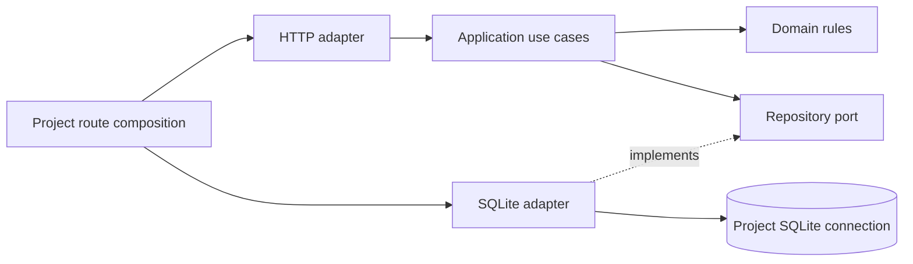

# Architecture decision: modular monolith with selective ports and adapters

Status: accepted direction; project settings and execution/delivery/conversation
core extractions implemented in this PR.
Infrastructure orchestration remains a mixed legacy architecture, not a completed
hexagonal migration. This distinction is intentional and reviewable.

## Objective

A future change should have an identifiable owner, a small public contract and
focused tests. An engineer or coding agent should be able to find the feature,
change its rule and validate it without loading the entire repository or mocking
unrelated managers. File count or the number of interfaces is not a success metric.

## Evidence from this repository

| Finding | Evidence | Consequence |
| --- | --- | --- |
| Persistence mixed unrelated responsibilities | [db facade](../../server/db.ts), [repositories](../../server/db/), [migration history](../../server/db/migrations.ts) | Separate connection/migration ownership from domain queries while preserving the public contract |
| Execution managers combine policy and infrastructure | [queue](../../server/queue-manager.ts) owns process handles, SQLite, scheduling, accounting and broadcasts; [loops](../../server/loop-run-manager.ts) imports filesystem, persistence and process types | Dependency inversion would make lifecycle changes easier to isolate; extraction must preserve recovery and transaction boundaries |
| A good strategy/adapter foundation already exists | [ProviderAdapter](../../server/providers/types.ts), [provider registry](../../server/providers/registry.ts), [loop executors](../../server/loop-executors.ts), [GitRunner](../../server/worktree-manager.ts) | Extend existing seams rather than building a competing abstraction framework |
| Transport code owned settings rules | [settings composition](../../server/project-router-settings.ts) previously validated models, environment names and branches inline | Move validation to a transport-independent domain and use cases; keep response translation in HTTP |
| Route dependencies are too broad for isolated features | [ProjectRoutesDeps](../../server/project-router-helpers.ts) exposes registry and complete project context | New modules receive narrow, project-bound ports rather than importing the registry |
| Dead islands and copied imports accumulated | [source audit](../../scripts/audit-source.mjs), [removal inventory](source-architecture.md) | Remove verified unused modules and prevent unused locals/imports with typecheck |
| AI instructions had become an implementation diary | [archived notes](legacy-implementation-notes.md) preserve the former root document | Small shared instructions plus a searchable source/test map reduce unrelated context |

## Decision

Keep one deployable desktop application: a **modular monolith**, organized by
business capability. Use hexagonal boundaries inside modules where infrastructure
and policy vary independently. Hexagonal architecture is a dependency direction,
not a requirement for six folders, classes everywhere, microservices, or a DI
container.

The new [project-settings module](../../server/modules/project-settings/README.md)
is the implemented reference:

Dependencies point inward: the application owns the repository contract. It does
not import SQLite, Express, the project registry or process globals. Production
composition supplies the SQLite adapter; unit tests supply a small in-memory fake.
HTTP status codes and response shapes remain in the HTTP adapter. Existing
`db.ts` consumers retain a compatibility facade while callers migrate gradually.

The repository's update contract is atomic: validate the whole patch before any
write, apply it in one transaction, then return persisted values. A new regression
test forces a later SQL statement to fail and proves earlier changes roll back.

### Where hexagonal architecture pays off

- **Execution:** scheduling and lifecycle rules versus process/provider transports,
  durable run state, clocks and notifications. Existing injected loop executors
  are a useful starting point, but `LoopRunManager` is not infrastructure-free.
- **PR delivery:** decision policy versus Git, GitHub, worktrees and ticket effects.
  Preserve the existing durable outbox/ownership semantics; do not replace them
  with an in-memory event bus.
- **Project configuration:** validation/defaults versus HTTP and persistence. This
  is the pilot implemented here, including an explicit public API and tests.
- **External integrations:** Jira/provider behavior already needs substitutable
  adapters and contract tests. Reuse those boundaries.

Plain rendering components, trivial formatting functions and one-off build scripts
do not need repository ports or application-service classes. Organize the frontend
by features as they are extracted; retain React hooks/components for UI state.
Do not force backend persistence patterns into React.

## Applying SOLID concretely

| Principle | Rule for this repo | Implemented evidence / remaining work |
| --- | --- | --- |
| Single responsibility | Separate policy, orchestration, persistence and transport by reason to change | Settings domain/use cases/adapters and DB repositories are separated; queue/chat/rail managers still need lifecycle-focused extractions |
| Open/closed | Add behavior through an existing provider strategy or module port when variation is real | Existing provider registry; settings application accepts a repository without knowing its implementation |
| Liskov substitution | All implementations must preserve the same behavioral contract, including failure semantics | Settings port specifies atomic update and normalized return values; provider adapters must preserve stream/usage/capability contracts rather than pretending unsupported features work |
| Interface segregation | Describe what the consumer needs, not everything a manager happens to expose | Settings repository has `read` and `update`; avoid passing `ProjectContext` into new domain/application modules |
| Dependency inversion | Domain/application own abstractions; composition selects infrastructure | Settings core imports only domain/port/shared pure validation; legacy queue still depends directly on SQLite and process APIs |

Use functions and composition when they suffice. An interface for every utility
or a generic `BaseManager` hierarchy would not improve these constraints.

## Design patterns to retain or introduce

| Pattern | Concrete application | Constraint |
| --- | --- | --- |
| Strategy and adapter | AI provider adapters; loop executors; HTTP/SQLite settings adapters | Reuse existing provider contracts and preserve capability differences |
| Application service / use case | `createProjectSettingsService` | No framework, DB connection, registry or transport types in its signature |
| Repository port | `ProjectSettingsRepository` | Use-case-specific operations; avoid a generic CRUD repository that hides transaction semantics |
| Facade | Existing `db.ts` API during extraction | Compatibility only; new business rules belong to their module |
| Composition root / factory | Route registration binds one project's service and repository | No global service locator, shared mutable project cache or container dependency |
| Transaction / unit of work | Atomic settings update; existing job/admission/settlement transactions | Keep related writes in one transaction and test rollback/restart behavior |
| State machine | Extracted delivery action policy and queue admission | Model explicit transitions only after existing lifecycle invariants are captured; avoid a second competing state representation |
| Durable outbox | Existing ticket effects in PR/recovery flows | Preserve durable replay and idempotency; do not substitute ephemeral pub/sub |

CQRS infrastructure, event sourcing, microservices, decorators and a dependency
injection framework are not justified by the inspected problems. Reconsider them
only against a concrete requirement and migration cost.

## Module contract and dependency enforcement

Each extracted feature has a public `index.ts`, domain rules, an application API,
ports for required external capabilities, adapters and a README with test commands.
The exact file count can vary; the import direction cannot.

[Architecture tests](../../server/modules/architecture.test.ts) enforce declared
core dependencies and block consumers from reaching into any extracted
module's internals. Only documented composition/compatibility files may import its
adapters. Typecheck enforces unused locals/imports. These checks run in normal CI.

The current tests protect all four extracted modules, not every legacy server file.
Extend the rule set as each module is migrated; do not claim global isolation from
the existence of a `modules` directory.

## Migration order and acceptance criteria

1. **Project settings — implemented.** Public use cases, domain validation,
   repository port, SQLite/HTTP adapters, atomic updates, pure application tests,
   adapter tests, legacy route regressions and dependency guards.
2. **Execution — partial.** [Scheduling and job accounting](../../server/modules/execution/README.md)
   now have pure policies and a narrow accounting port. Still separate budget
   policy, durable lifecycle storage and provider/process execution. Keep active
   slot reservation synchronous and settlement/recovery idempotent. Accept only
   after queue, interactive-session, crash-replay and accounting suites pass.
3. **PR delivery — partial.** [Decision rules and lifecycle vocabulary](../../server/modules/delivery/README.md)
   are independent of persistence. Still extract Git/publisher/ticket-effect ports.
   Preserve branch provenance, continuation identity, ownership and outbox replay.
   Use the existing isolated-launch and PR-decision suites as contracts.
4. **Chat and missions — partial.** [Resume context and stream rules](../../server/modules/conversations/README.md)
   are independent of I/O. Still separate turn orchestration,
   transports and persisted events. Preserve project switching and streaming state.
5. **Frontend features.** Move a cohesive feature with its hooks, UI, contracts and
   tests when its boundary is understood. Keep shared UI primitives genuinely
   shared; avoid a global catch-all services directory.

For each step: define the public API, inventory callers, capture invariants,
extract one vertical slice, wire it at composition, keep a temporary facade if
needed, add a dependency rule, run focused and affected integration tests, and
update the module guide/source map. Remove a facade only when no caller remains.

## AI and human navigation

[AGENTS.md](../../AGENTS.md) is the shared operational guide;
[CLAUDE.md](../../CLAUDE.md) imports it and supplies a short reference index.
The [generated source map](source-map.md) links source/build files and nearby
tests. Feature history lives in optional reference docs, not in mandatory startup
context. Update the narrowest guide instead of growing another root-level diary.
